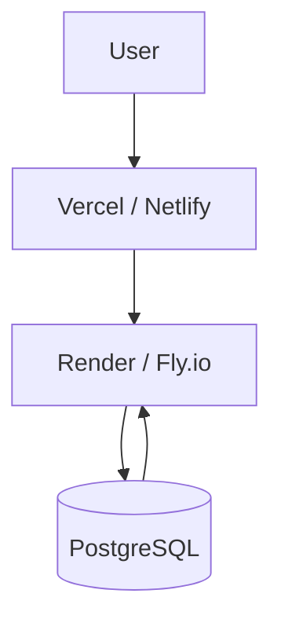

# Hosting & Deployment Report (Free Tier)

This document summarizes the hosting, deployment setup, community input, and lessons learned for the **vanemarendaja-borsibaar** project.  
Focus: **free-tier infrastructure**, trade-offs, and practical experience.

---

## Current Working Setup

### Frontend Hosting

**Vercel (Free)**
- Primary frontend hosting
- Automatic deployments on every GitHub push
- Excellent Next.js support (SSR, App Router)
- Global CDN

Live application:  
https://vanemarendaja-borsibaar.vercel.app/

**Netlify (Free) — Community feedback**
- Commonly used and reliable for frontend hosting
- Free tier is **frontend-only**
- Well suited for static sites and SPA frameworks (Vue.js, React)
- **Not suitable for Spring Boot backend hosting** on free tier

---

### Backend Hosting

**Render (Free)**
- Easy UI-based setup
- GitHub auto-deploy
- Free instances sleep on inactivity (cold start 30–60s)
- ⚠️ Render databases are free for **1 month only**, then deleted unless upgraded

**Fly.io (Free)**
- CLI-based, more DevOps-oriented
- Flexible runtime and networking
- Better control, but more setup effort

> Render and Fly.io are **alternatives**, not intended to be used together in production.  
> They are deployed in parallel here for learning and comparison.

---

### Databases

**Prisma DB (Free)**
- Very simple, plug-and-play
- Ideal for fast prototyping

**Supabase (Free)**
- Managed PostgreSQL
- Extras: Auth, UI, Storage
- More control and observability

**Neon (Serverless PostgreSQL)** *(community recommendation)*
- https://neon.com/
- Pure serverless Postgres
- Scales well and works nicely with modern backends

> Databases are **alternatives**. In real projects, typically only one is selected.

---

## Comparison Table

### Backend Hosting

| Feature        | Render (Free) | Fly.io (Free) |
|---------------|---------------|---------------|
| Ease of use   | ⭐⭐⭐⭐☆         | ⭐⭐⭐☆☆         |
| Setup method | UI-based      | CLI-based     |
| Cold starts  | Yes           | Yes (less obvious) |
| Flexibility  | Medium        | High          |
| Best for     | Quick demos   | DevOps learning |

### Databases

| Feature        | Prisma DB | Supabase | Neon |
|---------------|-----------|----------|------|
| Setup speed  | ⭐⭐⭐⭐☆     | ⭐⭐⭐☆☆    | ⭐⭐⭐⭐☆ |
| Full Postgres| Limited   | Yes      | Yes  |
| Extra features | Low     | High     | Low |
| Best for     | Prototypes| Full apps| Clean Postgres |

---

## Free-Tier Lifehacks

- Backend services may **sleep** on free tiers
- Use **UptimeRobot** to periodically ping the frontend
- Helps keep backend instances alive during free trials

---

## CI/CD Behavior

- GitHub push automatically triggers:
  - Frontend deploy (Vercel, Netlify)
  - Backend deploy (Render, Fly.io)
- No manual deployment steps required

**Exception: Cloudflare Pages**
- Requires static site output
- Needs GitHub Actions to build and upload artifacts

---

## Recommended Free Stack

**Beginner-friendly (fastest to launch):**
- Frontend: Vercel
- Backend: Render
- Database: Prisma DB or Neon

**More advanced / DevOps learning:**
- Frontend: Vercel or Cloudflare Pages
- Backend: Fly.io
- Database: Neon or Supabase

---

## Architecture Diagram

---

## Known Issues / TODO

- Backend ↔ frontend cross-site communication
  - CORS configuration
  - OAuth redirect URLs
  - Environment-specific base URLs

---

## Repository

Source code:  
https://github.com/Entangled-Systems/vanemarendaja-borsibaar/

---

## Summary

This project demonstrates that a modern web application can be deployed **entirely for free** using multiple providers.  
Free tiers come with limitations (sleeping instances, timeouts, data retention), but are excellent for:

- Learning
- Prototyping
- Portfolio projects

For production workloads, paid tiers or consolidated platforms are recommended.
